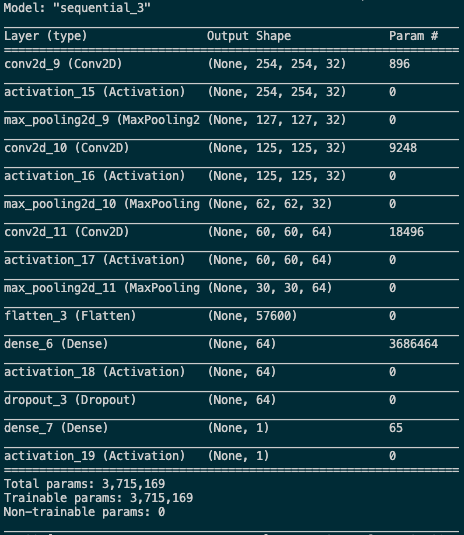
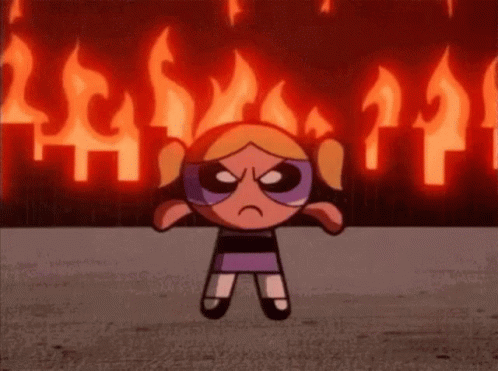
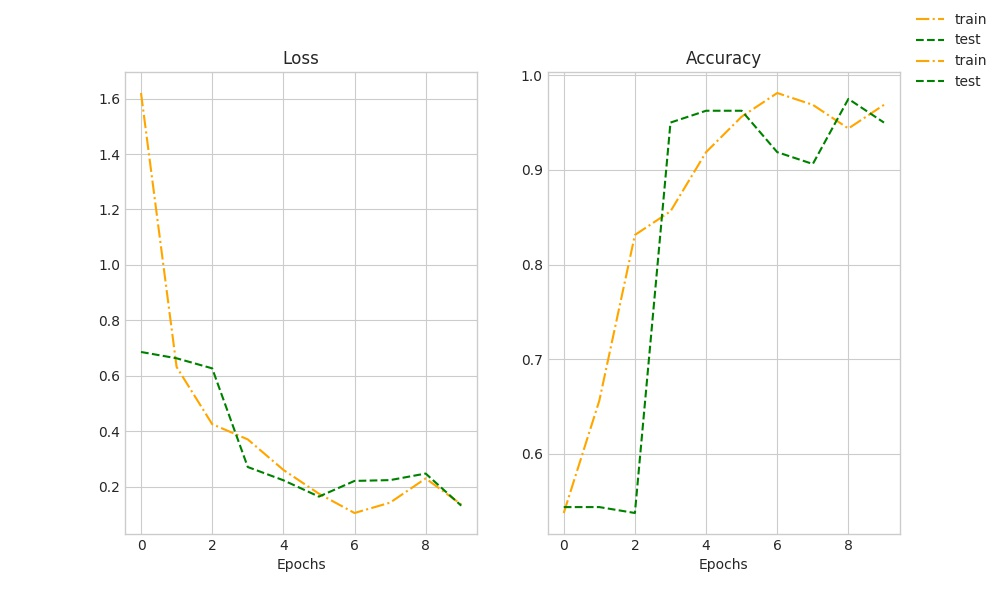

**********************************************
# Forest Fire Detection
**********************************************

#### Author: Chelsea Zaloumis
#### Galvanize DSI Capstone 2
*Last update: 8/22/2020*


# Background & Motivation

Today (8/22/2020), 92 forest fires are burning on approximately 1.5 million acres in 13 states. There are currently more than 24,000 wildland firefighters assigned and distributed to tackle these incidents according to The National Interagency Fire Center. Forest fires are not only destructive and dangerous, but their impact lingers with unhealthy air quality. My goal is to create a model to identify forest fires from images. Secondary/harder goal: I will explore the nasa_data to model the fire projected paths.

# Data

Kaggle fire images dataset: https://www.kaggle.com/phylake1337/fire-dataset
 * 2 folders
 * fireimages folder contains 755 outdoor-fire images some of them contains heavy smoke
 * non-fireimages folder contains 244 nature images (eg: forest, tree, grass, river, people, foggy forest, lake, animal, road, and waterfall)

# Image Preprocessing

The two classes are very imbalanced and the dataset overall is quite tiny, so I generated additional images bringing my total dataset to 1,630 'fire' images and 1,525 'not fire' images using the datagenerator below:

```
datagen = ImageDataGenerator(
        rotation_range=40,
        width_shift_range=0.2,
        height_shift_range=0.2,
        rescale=1./255,
        shear_range=0.2,
        zoom_range=0.2,
        horizontal_flip=True,
        fill_mode='nearest')
 ```
 
 
 
 # A not so *hot* CNN Model
 
Following this blog post: https://blog.keras.io/building-powerful-image-classification-models-using-very-little-data.html
 
I organized my data folders from:

        * fire
        * not fire
        
 to:
 
       * train         ->       fire & not fire
       * val           ->       fire & not fire
       * test          ->       fire & not fire
 

I then trained the following neural network which overfit to my training data (shown below in the high training accuracy).
 
 
 
 
 
Increasing dropout from 0.5 to 0.8 yielded a model that wasn't overfitting but performed poorly.
Evaluating this model on hold-out images resulted in accuracy no better than flipping a coin/guessing. I realized something was wrong with my images... 
Model evaluated on unseen hold-out images results:

        Loss: 2.1768    Accuracy: 5.0000  

 

Inspecting my newly constructed train, test, and val folders, I found the test and val *fire* subfolders filled with *non fire* images!!! Whoops...

 

# A *HOT* CNN Model

After emptying the non fire images from my fire folders and filling them randomly with fire images, I built a new neural network, not all that different from the first model. I made sure to include more dropout (after each convolutional layer):

 

This new model predicted beautifully with 96% accuracy on unseen hold-out images. I saved the model's weights and the model itself for future use without having to train.

 
 
This is better illustrated when we look at the images it was fed and compare it's prediction. Although there's only 6 images displayed, they accurately illustrate images that are easy to classify vs the one image the model did not classify correctly. The image the model couldn't detect fire in has a small area of fire with plenty of smoke. In comparison to the other 'non-fire' images, it looks very similar to fog.

 
